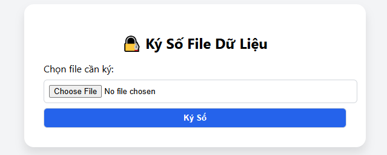

Ứng dụng RAS
 

🔧 Các Chức Năng Chính:
1. 📂 Chọn và tải lên file cần ký số
Giao diện cho phép người dùng chọn một file bất kỳ từ máy tính cá nhân.

Hệ thống hỗ trợ các định dạng văn bản (.txt, .docx, .pdf...) hoặc bất kỳ định dạng nào (binary file cũng được ký).

2. 🔐 Ký số dữ liệu bằng thuật toán RSA
Khi nhấn nút “Ký Số”, hệ thống:

Đọc nội dung file.

Tính toán mã băm (hash) của file.

Ký mã băm này bằng khóa bí mật RSA (private_key.pem).

File kết quả có phần chữ ký số (signature) đính kèm hoặc xuất ra file riêng biệt.

3. 🧾 Tải xuống chữ ký số
Sau khi ký thành công, người dùng có thể:

Tải xuống chữ ký số (thường là file .sig hoặc .txt).

Lưu trữ chữ ký để dùng trong bước xác minh sau này.

4. 📜 Kiểm tra và xác minh chữ ký số (nâng cấp sau)
Trong phiên bản mở rộng, bạn có thể thêm:

Giao diện để tải file cần kiểm tra + file chữ ký.

Hệ thống sẽ dùng khóa công khai (public_key.pem) để xác minh:

Nếu hợp lệ → "Chữ ký hợp lệ".

Nếu sai → "Chữ ký không hợp lệ hoặc file đã bị sửa".

5. 🗝️ Quản lý khóa RSA
Hệ thống có script riêng để:

Tạo cặp khóa mới (public/private) bằng file generate_keys.py.

Khóa được lưu trong thư mục keys/.

